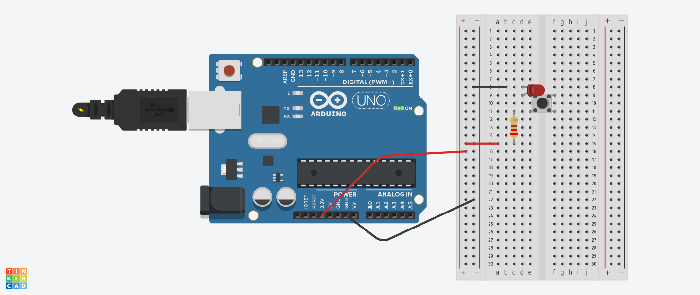

# PUSH-BUTTON LED
## Strictly speaking this isn't a true Arduino circuit, as it doesn't use the Arduino as a micro-controller, but just as a power source.
But! we have to start somewhere, right?
 

### Components
<ul><li>Breadboard</li><li>4 jumper wires</li><li>1 LED (red or Yellow or blue or green)</li><li>1 resistor 220Ω </li><li>1 Push-button or momentary switch</li><li>3.3V Powersource (2 * AA batteries or 3.3V from Arduino)</li></ul>

The description of the breadboard is the following: 
+ve 3.3V --> 220Ω resistor --> push-button side A | push-button side B --> LED Cathode (long leg) | LED Anode (short leg) --> GND (ground)

### Circuit
[Tinkercad Circuit HERE](https://www.tinkercad.com/things/9xUeer0X6EB-copy-of-mti-wk1-pushbutton-led-control/editel?sharecode=cIyxdK9e2WUOaW4_LjNROglKaD80nKwrlpZCZ1E31rc)

### Code
N/a (no code required, Arduino is merely a voltage regulator in this circuit, in fact it can run from a battery.

### Image of wiring
* we would ordinarily show a photo of this circuit 'irl', if someone wants to add their photo, ask to contribute/edit this page.
