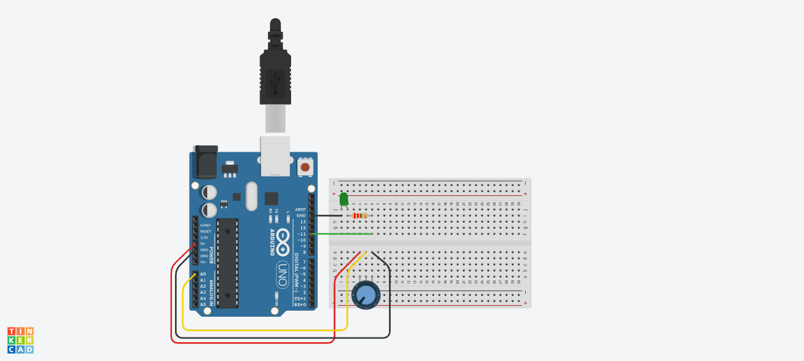

# [This circuit](https://www.tinkercad.com/things/kDyemUm2tMY-copy-of-mti-wk-1-homework-activity-potentiometer-led-brightness/editel?sharecode=vJ5iTFlidiakGMozK8gAvFgvLlHGYkCWnw3Ac37gmdo) allows a Potentiometer to control an LED

Here is the code:
<pre>int ledPin = 11;		// we must use one of the six PWM pins for this (3,5,6,9,10,11)
int ledBrightness = 0;	// a variable to keep track of our 'brightness' cycling over and over

int potPin = A0;
int potVal = 0;

void setup() {
  pinMode(ledPin, OUTPUT);
}

void loop() {

  potVal = analogRead(potPin);  // 0-1023 (2^10)
  
  // why divide by 4? analogRead returns 0-1023 (1024 different values)
  // analogWrite accepts 0-255 (256 different values)
  // 1024 is 4 * 256, which is why we divide by 4 to 'scale' the sensed value range to the output
  // we could also use the "map()" function
  
  ledBrightness = potVal / 4;		
    
  analogWrite(ledPin, ledBrightness);
  
  delay(10);
}
</pre>

  
