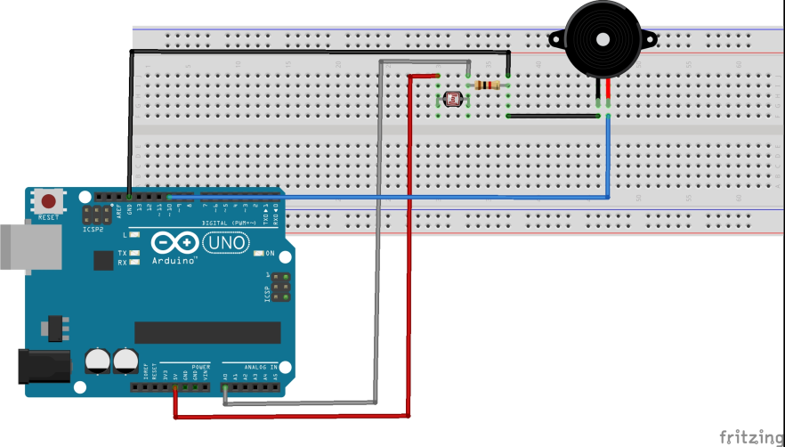

# Pseudo Theremin with LDR (photoresistor)
## This circuit uses light & shade to play tones through the buzzer
 
<pre>
  /* Quasi-theremin instrument
Connect the photoresistor one leg to pin 0, and the other pin to +5V
Connect a resistor (around 10k is a good value, higher
values gives higher readings) from pin 0 to GND.
Connect Speaker (buzzer) to A5 (+ve ) and GND (-ve)
----------------------------------------------------
           PhotoR     10K
 +5    o---/\/\/--.--/\/\/---o GND
                  |
 Pin A0 o-----------
 Pin A5 o------+/\/\/--------o GND
              Piezo Buzzer
----------------------------------------------------
*/

int lightPin = A0;   //define a pin for Photo resistor
long brightness; //variable for the reading from the photoresistor
const maxBrightness; //the ambient light at start up —to use as 'max calibration'
// introduce mapped variable "myTone"
int myTone = 0;
int speakerPin = A5;
int numTones = 10;
int tones[] = {261, 277, 294, 311, 330, 349, 370, 392, 415, 440, 457};
int numTones = 11; //Number of tones we are using (ie. length of tones array)
String notes[]={"mid C","C#","D","D#","E","E#","F","F#","G","G#","A"};

void setup()
{
  Serial.begin(9600);  //Begin serial communcation
  pinMode(speakerPin, OUTPUT);
  //setting a calibration brightness of the current room
  delay(100);
  maxBrightness = (analogRead(lightPin));
  Serial.println('calibration value: '+ brightness);
}
void loop()
{  
  // Read LDR & then Write the value of the photoresistor to the serial monitor to debug.
  brightness = (analogRead(lightPin));
  Serial.println(brightness); //debug th ebrightness reading
  myTone = map(brightness, 50, maxBrightness, 0, 10); //force the values (myTone) to 'cover' the range of the chosen tones - from tones[0] to tones[10]
  delay(100); //short delay for faster response to light.
  if (brightness > 50) {
      tone(speakerPin, tones[myTone], );
      Serial.println(notes[myTone]); //debug the note the brightness is mapped to
      delay(10);
    }
  else noTone(speakerPin); //if too dark, turn off the tone completely
  delay(200);                          //pause for 200 millis to allow tone to play and new reading
}
</pre>
## Further Reference: 
[Wot is a Theremin?](https://en.wikipedia.org/wiki/Theremin) 
[Who is a great Theremin Artist?](http://www.doritchrysler.com/projects.html) 
[More technical info about using the buzzer and tones...](https://www.programmingelectronics.com/an-easy-way-to-make-noise-with-arduino-using-tone/) 
Using [tone()](https://www.arduino.cc/reference/en/language/functions/advanced-io/tone/) 
Using [map(variable, haveMax, haveMin, wantMin, wantMax)](https://www.arduino.cc/reference/en/language/functions/math/map/) 
