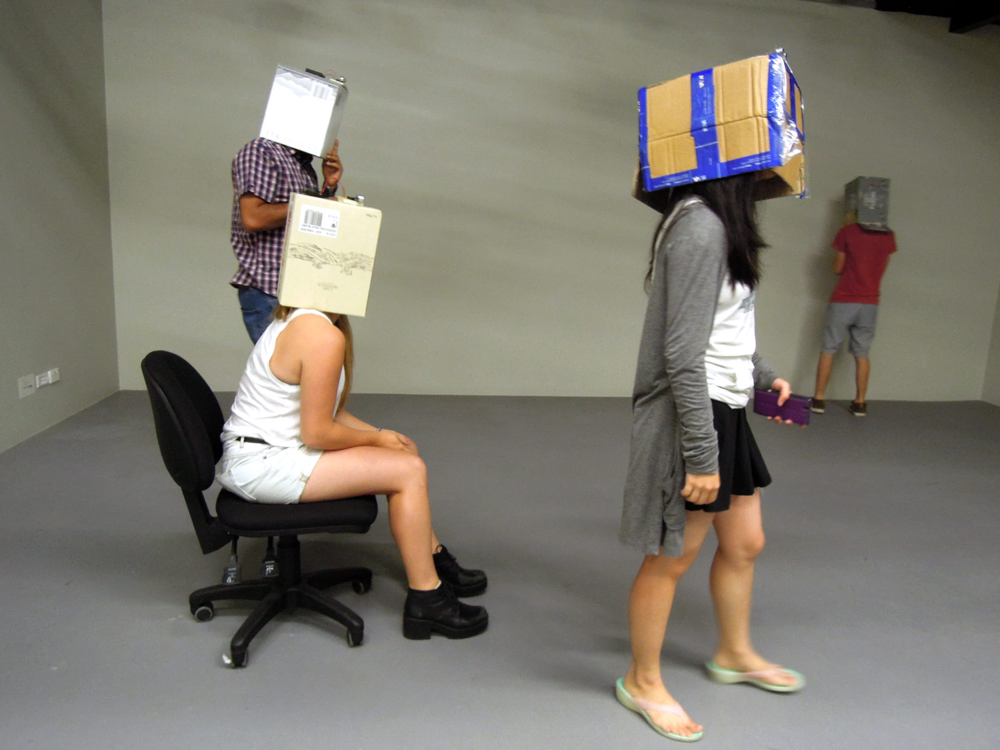

# Ultrasonic Bag (or box) - head (Ultrasonic obstacle detection)
 
## Make an ultrasonic + buzzer circuit like one of the ones below. Use an external power source (powerbank 9v or 4 x AA batteries will do) for your build and tape it all to the top of a paper bag or box. Place this on your head in a safe environment. Try to navigate. Try again in pairs?
<pre>
/*
This code will make the buzzer sound a warning tone when something be closer than 0.5m ** you can adjust the tone of the buzzer
Circuit is ultrasonic sensor on pins VCC->5V | GND -> GND | trig -> pin11 | echo -> pin12 | buzzer+ve -> pin 2 | buzzer -ve to GND 
*/
// Define pins for ultrasonic and buzzer
int const trigPin = 11;
int const echoPin = 12;
int const buzzPin = 2;

void setup()
{
  pinMode(trigPin, OUTPUT); // trig pin will have pulses output
  pinMode(echoPin, INPUT); // echo pin should be input to get pulse width
  pinMode(buzzPin, OUTPUT); // buzz pin is output to control buzzering
}
void loop()
{
  // Duration will be the input pulse width and distance will be the distance to the obstacle in centimeters
  int duration, distance;
 
  digitalWrite(trigPin, HIGH);  // Output pulse with 1ms width on trigPin
  delay(1);
  digitalWrite(trigPin, LOW);
  
  duration = pulseIn(echoPin, HIGH); // Measure the pulse input in echo pin
  
  distance = (duration/2) / 29.1; // Distance is half the duration devided by 29.1 (from datasheet)
  
  // if distance less than 0.5 meter and more than 0 (0 or less means over range)
  if (distance <= 50 && distance >= 0) { 
    tone(buzzPin, 120, 500); // Buzz at frequency 120hz for 500ms ** you could make the frequency relative to the distance ** 
  } 
  else {
    digitalWrite(buzzPin, 0);  // Don't buzz
  }
  // Waiting 60 ms won't hurt any one
  delay(60);
}
</pre>
## Alternative builds with LED etc...
[Arduino Distance Detector with "traffic light" LEDs & Buzzer](https://www.instructables.com/Arduino-Distance-Detector-with-a-Buzzer-and-LEDs/)
