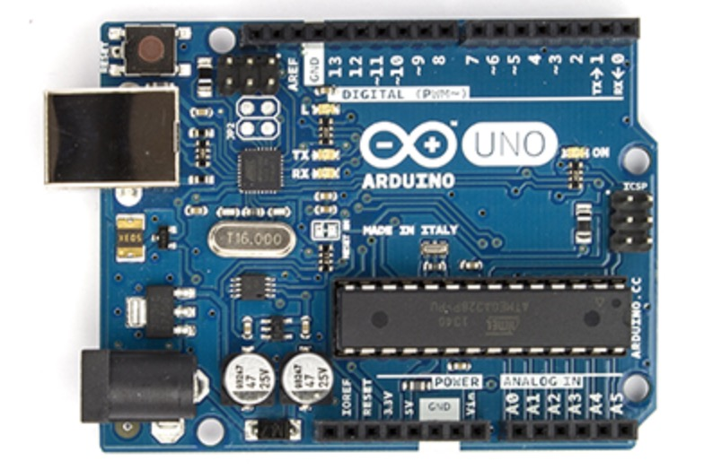
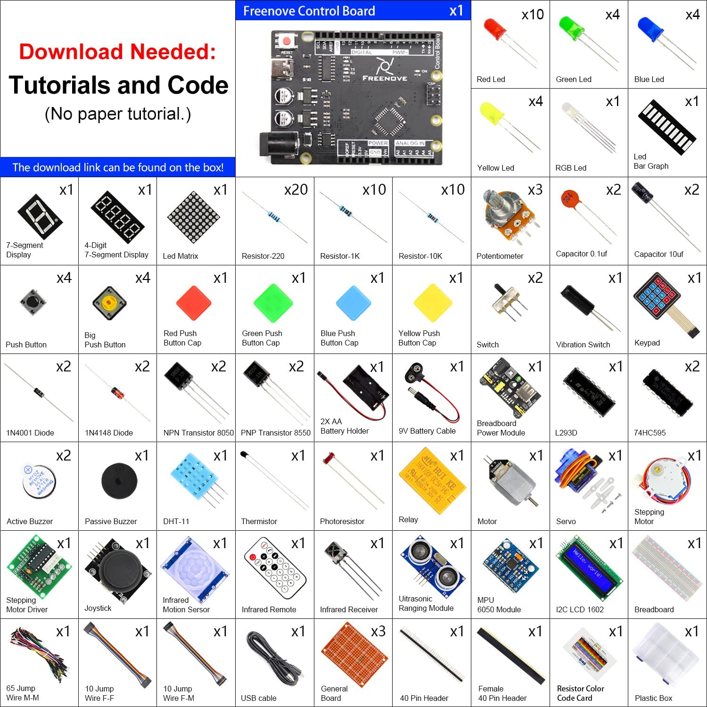

# Arduino Basics
## In this folder we will keep some of the more simple sketches & circuits for Arduino

# Wot is Arduino?
### Arduino is an open-source electronics prototyping platform based on flexible, easy-to-use hardware and software. It's intended for artists, designers, hobbyists, and anyone interested in creating interactive objects or environments. Or more simply, you load on some code and it can read sensors, perform actions based on inputs from buttons, control motors, and accept shields to further expand it's capabilities. Really, you can do almost anything.

All Arduino boards have one thing in common: they are programmed through the Arduino IDE. This is the software that allows you to write and upload code. Beyond that, there can be a lot of differences. The number of inputs and outputs (how many sensors, LEDs, and buttons you can use on a single board), speed, operating voltage, and form factor are just a few of the variables. Some boards are designed to be embedded and have no programming interface (hardware) which you would need to buy separately. Some can run directly from a 3.7V battery, others need at least 5V.

How to choose the right Arduino?	https://learn.sparkfun.com/tutorials/choosing-an-arduino-for-your-project/all
# Wot do I do with Arduino?
## This is a snapshot of the most common Arduino compatible components. They can do all sorts of things from 'sensing' to making light & noise, they can make things move 'see' hear and 'sing', measure our surroundings and communicate it back to us.

### to keep track of what our components can do, we are building a knowledge repository in this directory. See each folder for sample code, wiring image and build notes.

### 1. [Push-button LED](https://github.com/karenanndonnachie/MAKETHINGSINTERACTIVE_SEM2_2022/tree/main/ARDUINO_BASICS/1.%20PUSH_BUTTTON_LED)
### 2. [POTENTIOMETER_LED](2.%20POTENTIOMETER_LED/)
### 3. [Blink without delay()](3.BLINK_STATE_NO_DELAY/)
### 4. [Capacitive Touch](https://github.com/karenanndonnachie/MAKETHINGSINTERACTIVE_SEM2_2022/tree/main/Week3)
