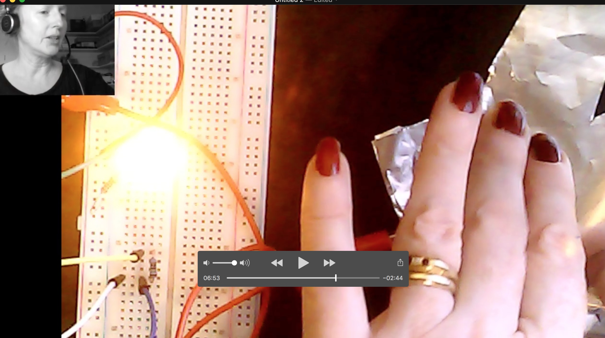
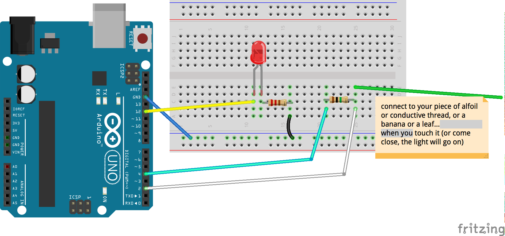

# Capacitive touch 
## Capacitive touch or touch control is very easy to build.
Essentially you are using the human body or a banana or a leaf or a piece of playdoh to close a circuit.
The 'makey-makey' project works off exactly this concept.
in this folder you will find a couple of different ways to build a touch circuit. in each case the circuit will work when you touch the 'live wire. The principle works because your body naturally 'finds ground' if you are floating or have very insulated shoes, it might not work, in which case you might need to touch the ground wire too! You can stick your alligator clip on anything that is either organic or conductive... try to touch a banana that is connected to the wire, or a potato, or some copper wire etc..
### I do a walkthrough of how to build the simplest touch sensor I have ever come across in the following video:

<a href="https://vimeo.com/697836123">Do touch! touch sensor with arduino &amp; resistors only</a>

Build for the above video:  

Code for the above video [remember the CapacitiveSensor library is also required]:

<pre>
/*
  Arduino Starter Kit example
  Project 13 - Touch Sensor Lamp
  This sketch is written to accompany Project 13 in the Arduino Starter Kit
  Parts required:
  - 1 megohm resistor
  - metal foil or copper mesh
  - 220 ohm resistor (* for RED LED — will need to be different if using a different coloured LED)
  - LED
  Software required :
  - CapacitiveSensor library by Paul Badger
    http://www.arduino.cc/playground/Main/CapacitiveSensor
  created 18 Sep 2012
  by Scott Fitzgerald
  http://www.arduino.cc/starterKit
  This example code is part of the public domain.
*/

// import the library (must be located in the Arduino/libraries directory)
#include <CapacitiveSensor.h>

// create an instance of the library
// pin 4 sends electrical energy
// pin 2 senses senses a change
CapacitiveSensor capSensor = CapacitiveSensor(4, 2);

// threshold for turning the lamp on
int threshold = 1100;
// pin the LED is connected to
const int ledPin = 12;
void setup() {
  // open a serial connection
  Serial.begin(9600);
  // set the LED pin as an output
  pinMode(ledPin, OUTPUT);
}
void loop() {
  // store the value reported by the sensor in a variable
  long sensorValue = capSensor.capacitiveSensor(30);

  // print out the sensor value
  Serial.println(sensorValue);

  // if the value is greater than the threshold
  if (sensorValue > threshold) {
    // turn the LED on
    digitalWrite(ledPin, HIGH);
  }
  // if it's lower than the threshold
  else {
    // turn the LED off
    digitalWrite(ledPin, LOW);
  }

  delay(10);
}
</pre>

## Alternative build WITH MORE THAN ONE TOUCH SENSOR:
 
This build requires THIS [.ino code](CapacitiveSensorSketch.ino) in this folder!
